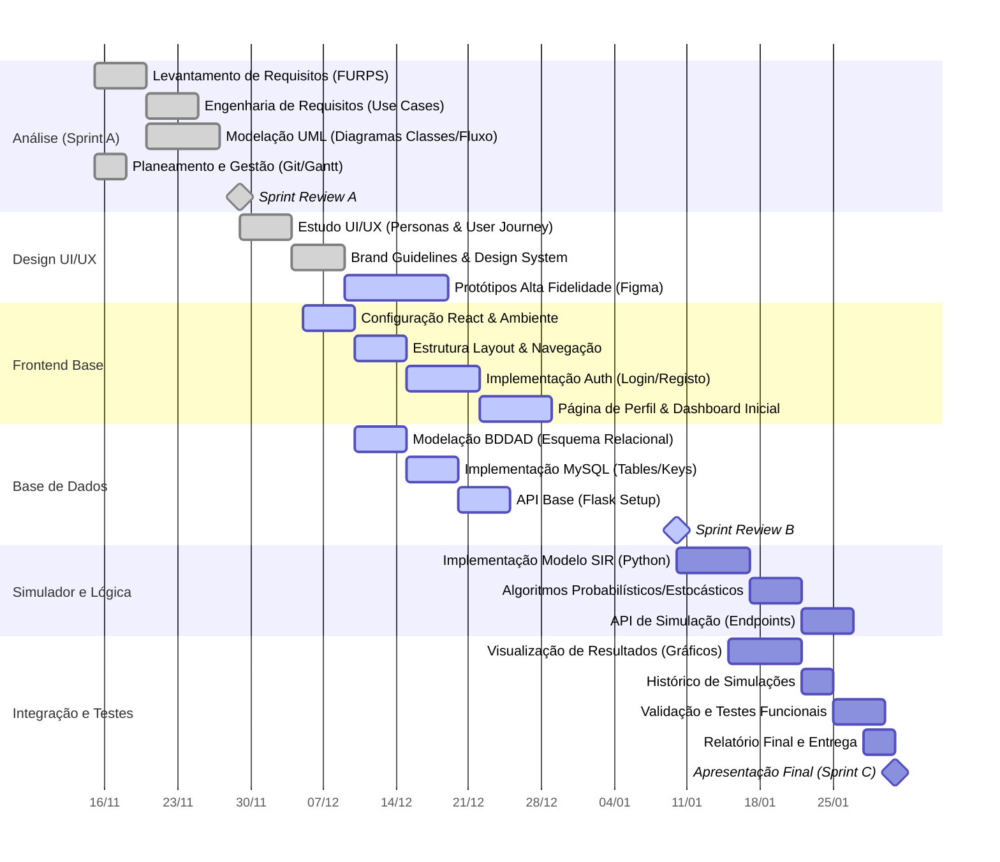

# Projeto S.E.I.O.S   Simulador Epidémico Interativo de Observação Sistémica #

**Instituição:** ISTEC Porto 
**Curso:** Engenharia Informática 
**Cadeira:** Sistemas Multimédia I 

**Fase:** Sprint C (Desenvolvimento) 

## Índice
- [Sobre o Projeto](#sobre-o-projeto)
- [Estrutura do Repositório](#estrutura-do-repositório)
- [Funcionalidades Planeadas](#funcionalidades-planeadas)
- [Mockup e Guia de Estilos](#mockup-e-guia-de-estilos)
- [Planeamento](#planeamento)
    - [GANT](#gant)
    - [Sprint A](#sprint-a)
    - [Sprint B](#sprint-b)
    - [Sprint C](#sprint-c)
- [Equipa](#equipa)

## Sobre o Projeto

Este repositório contém o projeto académico **S.E.I.O.S - Simulador Epidémico Interativo de Observação Sistémica**, desenvolvido no âmbito da unidade curricular de Sistemas Multimédia I. O objetivo principal é o desenvolvimento de um sistema de simulação, conforme descrito nas User Stories e documentação de requisitos.

Atualmente, o projeto encontra-se na fase de levantamento de requisitos, modelação e estruturação inicial.

## Estrutura do Repositório

A organização do projeto é a seguinte:

- **`docs/`**: Contém toda a documentação do projeto.
    - **`Documentação Técnica/`**: Pasta que contém documentação técnica, e.g. documentação de API.
    - `LEI-A2-S1-SMUL1-PI-UML.drawio`: Diagramas UML (Use Cases, Classes, etc.).
    - `DicionarioDados.xlsx`: Dicionário de Dados.
    - `FURPS.xlsx`: Levantamento de Requisitos Não Funcionais (FURPS+).
    - `Relatorio.docx`: Relatório de progresso e documentação geral.
    - `Sprint_A_Apresentacao_v0.pptx`: Apresentação da Sprint A.
- **`resources/`**: Recursos fornecidos pelo professor.
- **`frontend/`**: Diretoria reservada para o código da aplicação cliente (em implementação).
- **`backend/`**: Diretoria reservada para o código do servidor/API (em implementação).

## Funcionalidades Planeadas

Com base nas User Stories iniciais, o sistema irá incluir:

- **Execução de Simulações**: Funcionalidade central para correr cenários de simulação.
- **Gestão de Dados**: Estrutura relacional para suportar a informação do sistema.
- **Relatórios**: Geração de relatórios sobre o trabalho produzido e resultados das simulações.

## Mockup e Guia de Estilos

https://www.figma.com/design/sw3iULuP84DAQk1cRaNYcg/Medcei?node-id=0-1&t=d2eLfBD92OyiUZRc-1

## Planeamento

### GANT

### Sprint A

| User Story | Descrição | Obrigatoriedade | Responsável | Conclusão | Status |
| :--- | :--- | :--- | :--- | :--- | :--- |
| **US_A001** | *Como Gestor de Projeto, eu pretendo que a equipa faça o levantamento de requisitos funcionais e não funcionais, pelo método FURPS+.* | 1 | João | 100% | Completed |
| **US_A002** | *Como Analista de Software, eu pretendo perceber as funcionalidades do sistema através do diagrama de Use Cases, claro e completo.* | 1 | João | 100% | Completed |
| **US_A006** | *Como Programador, eu pretendo preparar, configurar e partilhar um repositório GitHub com a equipa de desenvolvimento e orientação.* | 2 | João | 100% | Completed |
| **US_A005** | *Como Analista de Software, eu pretendo detalhar o cenário de sucesso principal do UC “Executar Simulação” através da descrição estruturada de UC.* | 4 | João | 100% | Completed |
| **US_A008** | *Como Analista de Software, eu pretendo estruturar num fluxograma o processo detalhado do UC “Executar Simulação”.* | 4 | João | 100% | Completed |
| **US_A003** | *Como Gestor de Bases de Dados, eu pretendo perceber a estrutura e a relação da informação necessária ao sistema através do Modelo Relacional de Dados.* | 1 | Zé | 100% | Completed |
| **US_A004** | *Como Analista de Software, eu pretendo perceber o domínio do sistema, especificando os agregados, as entidades e os seus atributos, através do Modelo de Domínio.* | 1 | Zé | 100% | Completed |
| **US_A009** | *Como Gestor de Projeto, eu pretendo preparar a sprint review para apresentação (PPT ou outro) no dia de avaliação (deadline da sprint).* | 2 | Zé | 100% | Completed |
| **US_A010** | *Como Gestor de Projeto, eu pretendo compilar num relatório, todo o trabalho produzido.* | 3 | Zé | 100% | Completed |
| **US_A007** | *Como Analista de Software, eu pretendo detalhar informação específica do Modelo Relacional de Dados, num Dicionário de Dados (DD).* | 3 | Zé | 100% | Completed |

### Sprint B

| User Story | Descrição | Obrigatoriedade | Responsável | Conclusão | Status |
| :--- | :--- | :--- | :--- | :--- | :--- |
| **US_B001** | *Como Designer UI/UX, eu pretendo criar um protótipo (wireframes/mockups de alta fidelidade) da plataforma web com os ecrãs-chave, incluindo as páginas de registo, login, perfil do utilizador, configuração de simulação, visualização de resultados e histórico, respeitando os princípios de usabilidade e responsividade.* | 1 | João | 90% | Working |
| **US_B002** | *Como Designer UI/UX, eu pretendo definir e detalhar as personas dos utilizadores (mínimo duas, ex: investigador, profissional de saúde pública) e especificar os seus objetivos ao usar o simulador.* | 3 | João | 100% | Completed |
| **US_B003** | *Como Designer UI/UX, eu pretendo criar um guia de estilo web que especifique os elementos gráficos (paleta de cores, tipografia, iconografia, componentes de UI) para garantir a consistência visual da plataforma.* | 4 | João | 100% | Completed |
| **US_B004** | *Como Programador Frontend, eu pretendo configurar o ambiente de desenvolvimento React.js e criar a estrutura inicial da aplicação, incluindo os componentes básicos de layout (cabeçalho, rodapé, navegação).* | 1 | João | 50% | Working |
| **US_B005** | *Como Programador Frontend, eu pretendo implementar a página de registo de utilizadores, permitindo que novos utilizadores criem uma conta.* | 1 | João | 90% | Completed |
| **US_B006** | *Como Programador Frontend, eu pretendo implementar a página de login para que os utilizadores registados possam aceder à plataforma.* | 1 | João | 90% | Completed |
| **US_B007** | *Como Programador Frontend, eu pretendo desenvolver a página de perfil do utilizador, onde este pode visualizar e atualizar os seus dados pessoais.* | 4 | João | 0% | Delayed |
| **US_B008** | *Como Programador Backend, eu pretendo implementar o esquema da base de dados relacional (PostgreSQL) incluindo chaves primárias e estrangeiras.* | 1 | Zé | 100% | Completed |
| **US_B009** | *Como Programador Backend, eu pretendo desenvolver os endpoints da API (Flask) para o registo de novos utilizadores, garantindo a validação dos dados e o armazenamento seguro da palavra-passe.* | 3 | Zé | 100% | Completed |
| **US_B010** | *Como Programador Backend, eu pretendo desenvolver os endpoints da API (Flask) para a autenticação de utilizadores (login), validando as credenciais e gerando tokens de sessão.* | 2 | Zé | 100% | Completed |
| **US_B011** | *Como Programador Backend, eu pretendo desenvolver os endpoints da API (Flask) para a consulta e atualização dos dados do perfil do utilizador.* | 4 | Zé | 100% | Completed |
| **US_B012** | *Como Programador Backend, eu pretendo criar uma query e respetivo endpoint na API (Flask) para obter o número total de utilizadores registados e ativos na plataforma.* | 3 | Zé | 100% | Completed |
| **US_B013** | *Como Programador Backend, eu pretendo criar uma query e respetivo endpoint na API (Flask) para obter o número total de simulações realizadas na plataforma até ao momento.* | 2 | Zé | 100% | Completed |
| **US_B014** | *Como Programador Backend, eu pretendo criar uma query e respetivo endpoint na API (Flask) para obter o número de simulações realizadas por um utilizador específico.* | 2 | Zé | 100% | Completed |
| **US_B015** | *Como Gestor de Bases de Dados, eu pretendo popular a base de dados com dados de exemplo (ex: um administrador, alguns utilizadores, algumas simulações fictícias) para facilitar o desenvolvimento e testes iniciais das funcionalidades e queries de dashboard.* | 4 | Zé | 100% | Completed |
| **US_B016** | *Como Gestor de Projeto, eu pretendo que a equipa atualize o plano de trabalho no Diagrama de Gantt para a Sprint B.* | 2 | João | 100% | Completed |
| **US_B017** | *Como Gestor de Projeto, eu pretendo que a equipa prepare a apresentação para Sprint review B, destacando os protótipos de UI/UX, a estrutura frontend e queries iniciais implementadas.* | 2 | João | 100% | Completed |
| **US_B018** | *Como Gestor de Projeto, eu pretendo compilar num relatório, todo o trabalho produzido.* | 3 | Zé | 100% | Completed | 

### Sprint C

| User Story | Descrição | Obrigatoriedade | Responsável | Conclusão | Status |
| :--- | :--- | :--- | :--- | :--- | :--- |
| **US_C001** | *Como Utilizador Registado, eu pretendo aceder a um formulário para configurar os parâmetros de uma simulação (exemplo: a população total, o número inicial de infetados, a taxa de contacto efetivo (β), a taxa de recuperação (γ) e a duração da simulação).* | 1 | João | 0% | Pending |
| **US_C002** | *Como Programador Backend, eu pretendo implementar o motor de simulação que utilize um modelo epidemiológico estocástico do tipo SIR (Suscetíveis-Infetados-Recuperados), onde as transições entre os estados (S→I e I→R) são calculadas com base em distribuições probabilísticas (exemplo: distribuição binomial ou de Poisson), em cada passo de tempo, para refletir a aleatoriedade e os "efeitos de 1º grau" da propagação.* | 1 | Zé | 0% | Pending |
| **US_C003** | *Como Utilizador Registado, eu pretendo poder executar uma simulação com os parâmetros que defini e que o sistema processe o modelo epidemiológico de forma eficiente.* | 1 | Zé | 0% | Pending |
| **US_C004** | *Como Utilizador Registado, eu pretendo que o sistema calcule e apresente o número de reprodução efetivo (Rt) da doença ao longo da simulação, utilizando a fórmula de Von Foerster (Rt = taxa de infeção * duração média da infeção), permitindo compreender a "intensidade em relação à propagação" em diferentes fases da epidemia.* | 3 | Zé | 0% | Pending |
| **US_C005** | *Como Utilizador Registado, eu pretendo visualizar graficamente a evolução das populações de Suscetíveis, Infetados e Recuperados ao longo do tempo (curva epidémica), com os resultados do modelo estocástico.* | 1 | João | 0% | Pending |
| **US_C006** | *Como Utilizador Registado, eu pretendo poder guardar os parâmetros configurados e os resultados da simulação na base de dados para consulta posterior.* | 3 | Zé | 0% | Pending |
| **US_C007** | *Como Utilizador Registado, eu pretendo aceder a um histórico das minhas simulações guardadas, podendo consultar os seus parâmetros e visualizar novamente os gráficos de resultados.* | 2 | João | 0% | Pending |
| **US_C008** | *Como Administrador, eu pretendo poder aceder a uma área restrita (interface simples) para gerir utilizadores (exemplo: visualizar lista, alterar tipo de acesso, alterar estado).* | 3 | João | 0% | Pending |
| **US_C009** | *Como QA, eu pretendo criar uma lista de testes para o motor de simulação (Python), validando a correção dos cálculos probabilísticos e as transições de estado.* | 3 | Zé | 0% | Pending |
| **US_C010** | *Como QA, eu pretendo realizar testes às funcionalidades de configuração e execução de simulação, bem como à visualização de resultados, documentando os defeitos e a sua resolução.* | 3 | João | 0% | Pending |
| **US_C011** | *Como Utilizador Registado, eu pretendo poder exportar os dados brutos da simulação num formato comum (exemplo: CSV) para que possa realizar análises externas mais detalhadas.* | 4 | Zé | 0% | Pending |
| **US_C012** | *Como Gestor de Projeto, eu pretendo que a equipa prepare a apresentação final do projeto para a Sprint Review C, demonstrando todas as funcionalidades implementadas, os resultados dos testes e as aprendizagens obtidas.* | 1 | João | 0% | Pending |
| **US_C013** | *Como Gestor de Projeto, eu pretendo que a equipa atualize o plano de trabalho no Diagrama de Gantt para a Sprint C.* | 3 | João | 0% | Pending |
| **US_C014** | *Como Gestor de Projeto, eu pretendo criar um poster de apresentação do projeto, destacando os objetivos, a metodologia (modelo SIR estocástico, uso de React/Flask/MySQL), os resultados da simulação e as conclusões principais, para a avaliação final.* | 4 | João | 0% | Pending |
| **US_C015** | *Como Gestor de Projeto, eu pretendo compilar um relatório final abrangente que documente todas as fases do projeto (análise, design, implementação, testes), as decisões técnicas e os resultados alcançados.* | 1 | Zé | 0% | Pending |

## Equipa

- **João Ventura** (2024064)
- **José Ferreira** (2024128)

---
*Este ficheiro será atualizado à medida que o desenvolvimento avança para as fases de implementação.*
